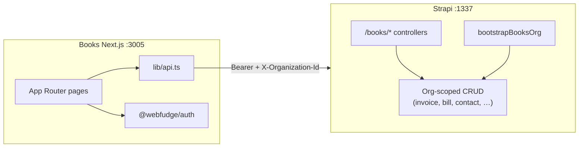

# Books App — Functionality Guide

Complete assessment of the current Books app state and a phased plan to make it production-functional by wiring the existing UI to the Strapi backend.

---

## Summary

| Layer | Status |
|-------|--------|
| **UI shell** | ~95% complete — 51 routes, CRM-aligned list/add pages, theme, sidebar, reports hub |
| **API client** (`apps/books/lib/api.ts`) | ~100% defined — CRUD + dashboard + reports + banking |
| **Strapi backend** (`apps/backend`) | Substantial — org-scoped CRUD, `/books/*` aggregates, bootstrap |
| **Frontend ↔ backend wiring** | ~10–15% — a handful of list pages and reads; **no create saves**, **no detail/edit routes** |

**Bottom line:** Books is a polished Zoho Books–style scaffold. The fastest path to “functional” is connecting pages to APIs that already exist—not rebuilding UI or backend from scratch.

---

## Scope

| Area | Path |
|------|------|
| Books app | `apps/books` (`@webfudge/books`, port **3005**) |
| API client & types | `apps/books/lib/api.ts`, `apps/books/lib/types.ts` |
| Strapi backend | `apps/backend/src/api/books/`, `apps/backend/src/utils/books-crud.js`, 20+ content types |
| Shared UI | `packages/ui/book-components/`, `@webfudge/ui` with `theme="books"` |
| Auth | `@webfudge/auth` (same as CRM/PM/Accounts) |

---

## Architecture



### Request contract

Every API call from `lib/api.ts` sends:

- `Authorization: Bearer <token>` from `localStorage` (`strapi_token` or `auth-token`)
- `X-Organization-Id` from `localStorage` (`current-org-id`)
- Base URL: `NEXT_PUBLIC_STRAPI_URL` → `NEXT_PUBLIC_API_URL` → fallback `http://localhost:1338`

**Important:** `.env.example` uses port **1337**. The code fallback uses **1338**. Always set `NEXT_PUBLIC_API_URL=http://localhost:1337` in `apps/books/.env.local` to avoid silent connection failures.

### Monetary values

All amounts in the API are stored as **integers in paise/cents**. Use `formatCurrency` from `@webfudge/utils` in the UI.

### Customers vs contacts

Customers are Strapi **`/contacts`** with `isCustomer: true`, not a separate `books-customer` type. The older `BOOKS_APP_UPDATE.md` spec is outdated on this point.

---

## Local development

### Prerequisites

1. Strapi backend running (default port **1337**)
2. Valid user login via `@webfudge/auth`
3. Active organization: `localStorage.setItem('current-org-id', '<orgId>')` — set by Accounts landing / org switcher (see `ORG_CREATOR_ADMIN_USERS_SYNC.md`)

### Commands

```bash
# From repo root
npm run dev:books          # Books → http://localhost:3005

# Backend (separate terminal, if not already running)
cd apps/backend && npm run develop
```

### Environment (`apps/books/.env.local`)

```env
NEXT_PUBLIC_API_URL=http://localhost:1337
```

### First-time org setup

After login, call **`booksActivate()`** once per org (Owner/Admin only):

- Seeds chart of accounts via `apps/backend/src/api/books/services/bootstrap.js`
- Sets `booksActivated` on the organization

Wire this in `LayoutContent` or post-login flow when `booksActivated` is false.

---

## Current integration status

### ✅ Wired (reads or partial logic)

| Route / area | Implementation |
|--------------|----------------|
| `/sales/customers` | `booksApi.fetchCustomers()` → `BooksSalesListShell` |
| `/sales/invoices` | `booksApi.fetchInvoices()` |
| `/banking` | `bankingApi.overview()` |
| `/time-tracking/projects` | `booksApi.fetchProjects()` |
| `/time-tracking/timesheet` | `timesheetApi.weekly()` |
| `/home` (partial) | Client-side aggregation from multiple entity fetches |
| `/reports` (partial) | Fetches entities but **`zeroMode = true`** forces KPI/chart zeros |

### ⚠️ UI complete, `data={[]}` (no fetch)

**Sales (7):** estimates, retainer-invoices, sales-orders, delivery-challans, payments-received, recurring-invoices, credit-notes

**Purchases (8):** vendors, expenses, recurring-expenses, purchase-orders, bills, payments-made, recurring-bills, vendor-credits

**Accountant (5):** manual-journals, bulk-update, currency-adjustments, chart-of-accounts, transaction-locking

### ❌ Mock / stub / broken

| Area | Issue |
|------|-------|
| **All create pages** | `BooksCrmAddEntityPage` — 500ms fake submit, no API |
| **`/items/all`** | Hardcoded `ITEM_ROWS` |
| **Home hub pages** | `homeHubMock.ts` static data |
| **`/documents`, `/documents/bank-statements`** | `ModulePage` with 2 fake rows |
| **`/items/price-lists`, `/items/inventory-adjustments`** | `ModulePage` stub |
| **`/threads`** | Empty state only |
| **Reports balance sheet / cash flow** | Links to `/coming-soon` |
| **`/items/new`** | Linked from topbar `getAddHref()` — **page does not exist** |
| **`/time-tracking/projects/new`** | Uses `ModulePage` instead of create form |
| **Detail/edit `[id]` routes** | None exist for any entity |

### API defined but unused in UI

| Export | Endpoints |
|--------|-----------|
| `dashboardApi` | `/books/dashboard/kpis`, `profit-loss`, `cash-flow`, `recent-activities`, `top-expenses` |
| `reportsApi` | `/books/reports/profit-loss`, `balance-sheet`, `cash-flow`, aging, utilization, … |
| `booksActivate` | `POST /books/activate` |
| Most `*Api.create/update/delete` | Full CRUD in `api.ts`, not called from pages |

---

## Reference pattern: wiring a list page

Use **`/sales/customers`** as the template for every list page.

### 1. Fetch on mount

```tsx
'use client'

import { useEffect, useState } from 'react'
import { booksApi } from '@/lib/api'
import type { Vendor } from '@/lib/types'
import BooksPurchasesListShell from '../_components/BooksPurchasesListShell'

export default function VendorsPage() {
  const [rows, setRows] = useState<Vendor[]>([])

  useEffect(() => {
    booksApi.fetchVendors()
      .then((res) => setRows(res.data ?? []))
      .catch(() => setRows([]))
  }, [])

  return (
    <BooksPurchasesListShell
      title="Vendors"
      data={rows}
      /* columns, kpis, tabs — map from row fields */
    />
  )
}
```

### 2. Map API → table columns

- Read field names from `apps/books/lib/types.ts`
- Normalize status strings for `Badge` variants (see `invoices/page.tsx`)
- Compute KPIs with `useMemo` over the fetched array (customers page pattern)

### 3. Per-module API mapping

| Module | Page path | API to use |
|--------|-----------|------------|
| Customers | `/sales/customers` | `customersApi` / `booksApi.fetchCustomers` ✅ |
| Estimates | `/sales/estimates` | `estimatesApi.list` |
| Invoices | `/sales/invoices` | `invoicesApi` ✅ |
| Credit notes | `/sales/credit-notes` | `creditNotesApi.list` |
| Vendors | `/purchases/vendors` | `vendorsApi` / `booksApi.fetchVendors` |
| Bills | `/purchases/bills` | `billsApi` / `booksApi.fetchBills` |
| Expenses | `/purchases/expenses` | `expensesApi` / `booksApi.fetchExpenses` |
| Items | `/items/all` | `itemsApi` / `booksApi.fetchItems` |
| Manual journals | `/accountant/manual-journals` | `journalsApi` / `booksApi.fetchManualJournals` |
| Chart of accounts | `/accountant/chart-of-accounts` | `chartOfAccountsApi.list` |
| Documents | `/documents` | `documentsApi` / `booksApi.fetchDocuments` |

Full API surface: `apps/books/lib/api.ts` (lines 62–307).

---

## Reference pattern: wiring create forms

`BooksCrmAddEntityPage` (`apps/books/app/_components/BooksCrmAddEntityPage.tsx`) currently ends with a placeholder:

```ts
// Placeholder submit - backend not connected yet.
await new Promise((r) => setTimeout(r, 500))
```

### Recommended approach

**Option A — Page-level submit (minimal change)**  
Keep `BooksCrmAddEntityPage` presentational; each `*/new/page.tsx` wraps it and passes `onSubmit`:

```tsx
// apps/books/app/sales/customers/new/page.tsx
import { customersApi } from '@/lib/api'
import BooksCrmAddEntityPage from '@/app/_components/BooksCrmAddEntityPage'

export default function NewCustomerPage() {
  const router = useRouter()

  const onSubmit = async (values: Record<string, string>) => {
    await customersApi.create({
      name: values.name,
      email: values.email,
      /* map fields */
    })
    router.push('/sales/customers')
  }

  return <BooksCrmAddEntityPage sections={...} onSubmit={onSubmit} />
}
```

**Option B — Extend shared component**  
Add optional props to `BooksCrmAddEntityPage`:

```ts
onSubmit?: (values: Record<string, string>) => Promise<void>
redirectOnSuccessHref?: string
```

Then update `onSubmit` to call the handler, show errors, and redirect.

### Create page inventory

| Path | Target API |
|------|------------|
| `/sales/customers/new` | `customersApi.create` |
| `/sales/invoices/new` | `invoicesApi.create` |
| `/sales/[module]/new` | Module-specific (estimates, credit-notes, …) |
| `/purchases/vendors/new` | `vendorsApi.create` |
| `/purchases/[module]/new` | bills, expenses, POs, … |
| `/accountant/[module]/new` | journals, chart-of-accounts, … |
| `/items/new` | **Create page +** `itemsApi.create` |
| `/time-tracking/projects/new` | Replace `ModulePage` → `projectsApi.create` |

---

## Phased implementation plan

### Phase 0 — Foundation (1–2 days)

**Goal:** Reliable auth, org context, and activation.

| # | Task | Files / notes |
|---|------|----------------|
| 0.1 | Fix API base URL fallback `1338` → `1337` in `lib/api.ts` | Align with `.env.example` |
| 0.2 | Ensure `current-org-id` is set after login (mirror Accounts/CRM) | `@webfudge/auth` flow, landing profile |
| 0.3 | Call `booksActivate()` when org has no `booksActivated` | `LayoutContent.tsx` or auth callback |
| 0.4 | Fix backend route `auth: false` vs controller `ctx.unauthorized()` | `apps/backend/src/api/books/routes/books.js` — enable auth middleware or document dev bypass |
| 0.5 | Remove `@ts-nocheck` on customers page | Fix `Customer` types vs API response |

**Verification:** Login → select org → `POST /api/books/activate` returns 200 → chart of accounts seeded.

---

### Phase 1 — Core data loop (3–5 days)

**Goal:** Users can create and list the main entities.

| # | Task | Priority |
|---|------|----------|
| 1.1 | Wire `BooksCrmAddEntityPage` submit (Option A or B) | P0 |
| 1.2 | Wire all **Sales** list pages (7 remaining) | P0 |
| 1.3 | Wire all **Purchases** list pages (8) | P0 |
| 1.4 | Create `/items/new` + wire `/items/all` to `itemsApi` | P0 |
| 1.5 | Fix `/time-tracking/projects/new` create form | P1 |

**Verification:** Create customer → appears in list. Same for vendor, invoice, bill, item.

---

### Phase 2 — Dashboard & reports (2–3 days)

**Goal:** Home and `/reports` show real numbers.

| # | Task | API |
|---|------|-----|
| 2.1 | Replace home KPI aggregation with `dashboardApi.kpis()` | `/books/dashboard/kpis` |
| 2.2 | Wire recent activity / top expenses widgets | `recentActivities`, `topExpenses` |
| 2.3 | Set `zeroMode = false` in `BooksSystemAnalytics.tsx` | Use `dashboardApi` / `reportsApi` |
| 2.4 | Implement balance sheet & cash flow report pages | `reportsApi.balanceSheet`, `cashFlow` |
| 2.5 | Replace `homeHubMock.ts` on `/home/activity`, announcements, recent-updates | `dashboardApi.recentActivities()` |

**Verification:** Dashboard KPIs match Strapi data; charts non-zero when data exists.

---

### Phase 3 — Accountant, banking, time (2–3 days)

| # | Task | API |
|---|------|-----|
| 3.1 | Wire 5 accountant list pages | `journalsApi`, `chartOfAccountsApi`, … |
| 3.2 | Replace `BooksChartPlaceholderCard` with `journalsApi.postingTrend()` | `/books/accountant/posting-trend` |
| 3.3 | Banking: account CRUD + transaction categorize UI | `bankingApi.accounts`, `transactions` |
| 3.4 | Timesheet create/edit entries | `tasksApi`, timer endpoints |

---

### Phase 4 — Documents, threads, polish (3–5 days)

| # | Task | Notes |
|---|------|-------|
| 4.1 | Documents list + upload | `documentsApi`; reference CRM `uploadService` |
| 4.2 | Threads / conversations | Strapi `direct-message` or CRM threads pattern |
| 4.3 | Add `[id]` detail routes for invoices, customers, bills, … | View + edit + delete |
| 4.4 | Optional: persist feature prefs via Strapi org settings | Today: `localStorage` only (`books-features`) |
| 4.5 | Optional: Next.js `middleware.ts` for server-side route guard | Today auth is client-only in `LayoutContent` |

---

## Backend reference

### Books aggregate routes

`apps/backend/src/api/books/routes/books.js`:

| Method | Path | Handler purpose |
|--------|------|-----------------|
| POST | `/books/activate` | Bootstrap org |
| GET | `/books/dashboard/kpis` | Dashboard metrics |
| GET | `/books/dashboard/profit-loss` | P&L series |
| GET | `/books/dashboard/cash-flow` | Cash flow series |
| GET | `/books/dashboard/recent-activities` | Activity feed |
| GET | `/books/dashboard/top-expenses` | Top expenses |
| GET | `/books/banking/overview` | Banking KPIs + accounts |
| GET | `/books/accountant/posting-trend` | Journal posting chart |
| GET | `/books/timesheet/weekly` | Weekly timesheet grid |

Reports routes: `apps/backend/src/api/books/routes/reports.js` (profit-loss, balance sheet, aging, utilization, …).

### Org-scoped CRUD

`apps/backend/src/utils/books-crud.js` — factory used by invoice, bill, vendor, expense, item, bank-account, manual-journal, chart-of-accounts, document, etc.

### Content types (representative)

`invoice`, `bill`, `vendor`, `expense`, `item`, `bank-account`, `bank-transaction`, `manual-journal`, `chart-of-account`, `estimate`, `credit-note`, `purchase-order`, `project`, `task`, `document`, …

---

## Known issues & pitfalls

| Issue | Impact | Fix |
|-------|--------|-----|
| Port 1338 vs 1337 default | API calls fail silently | Set `NEXT_PUBLIC_API_URL` in `.env.local` |
| Missing `current-org-id` | 403 from backend | Set on org switch (Accounts pattern) |
| `auth: false` on `/books/*` routes but controller checks `ctx.state.user` | 401 in production | Align Strapi route config with auth middleware |
| `BooksCrmAddEntityPage` no `onSubmit` prop | All creates are fake | Phase 1.1 |
| No `[id]` routes | No view/edit/delete | Phase 4.3 |
| `zeroMode` in analytics | Reports always show zeros | Phase 2.3 |
| `/items/new` missing | Topbar Add 404 | Phase 1.4 |

---

## Testing checklist

Use this after each phase:

### Auth & org

- [ ] Login redirects unauthenticated users to `/login`
- [ ] `current-org-id` present in localStorage after org select
- [ ] API requests include `Authorization` and `X-Organization-Id`

### Activation

- [ ] First visit triggers `booksActivate()` (Admin/Owner)
- [ ] Chart of accounts exists for org

### Sales

- [ ] List customers, invoices, estimates, credit notes
- [ ] Create customer → visible in list
- [ ] Create invoice → visible in list

### Purchases

- [ ] List vendors, bills, expenses
- [ ] Create vendor → visible in list

### Items & time

- [ ] `/items/all` shows API data
- [ ] `/items/new` creates item
- [ ] Projects list + create project

### Dashboard & reports

- [ ] `/home` KPIs match backend
- [ ] `/reports` charts show non-zero data when records exist
- [ ] Balance sheet / cash flow pages load (not coming-soon)

### Banking & accountant

- [ ] Banking overview loads accounts
- [ ] Manual journals list + create
- [ ] Chart of accounts list

---

## Related documentation

Existing Books docs focus on **UI/UX** (shell, theme, list alignment, add-page styling). Use this guide for **backend wiring**.

| Doc | Topic |
|-----|-------|
| [BOOKS_APP_UPDATE.md](./BOOKS_APP_UPDATE.md) | Initial scaffold (partially outdated API spec) |
| [BOOKS_SALES_PAGES_CRM_UI_ALIGNMENT.md](./BOOKS_SALES_PAGES_CRM_UI_ALIGNMENT.md) | Sales list UI |
| [BOOKS_PURCHASES_PAGES_CRM_UI_ALIGNMENT.md](./BOOKS_PURCHASES_PAGES_CRM_UI_ALIGNMENT.md) | Purchases list UI |
| [BOOKS_CRM_STYLE_ADD_PAGES.md](./BOOKS_CRM_STYLE_ADD_PAGES.md) | Add form UI (not API) |
| [ORG_CREATOR_ADMIN_USERS_SYNC.md](./ORG_CREATOR_ADMIN_USERS_SYNC.md) | `current-org-id` behavior |
| [MODAL_NAV_PANEL_BOOKS_CRM.md](./MODAL_NAV_PANEL_BOOKS_CRM.md) | Module nav modal |

**CRM comparison:** `apps/crm/lib/api/*Service.js` is the mature pattern Books should mirror—service per entity, consistent error handling, list + create + update flows.

---

## Suggested work order (single developer)

```
Week 1: Phase 0 + Phase 1.1–1.3 (foundation, creates, sales + purchases lists)
Week 2: Phase 1.4–1.5 + Phase 2 (items, dashboard, reports)
Week 3: Phase 3 + Phase 4.1–4.3 (accountant, documents, detail routes)
```

**Highest ROI first:** create submit → purchases vendors/bills → remaining sales lists → `dashboardApi` on home → remove `zeroMode`.

---

## File quick reference

| Purpose | Path |
|---------|------|
| API client | `apps/books/lib/api.ts` |
| Types | `apps/books/lib/types.ts` |
| List shell (sales) | `apps/books/app/sales/_components/BooksSalesListShell.tsx` |
| List shell (purchases) | `apps/books/app/purchases/_components/BooksPurchasesListShell.tsx` |
| Add form shell | `apps/books/app/_components/BooksCrmAddEntityPage.tsx` |
| Auth layout gate | `apps/books/components/layout/LayoutContent.tsx` |
| Route meta / Add href | `apps/books/lib/routes.ts` |
| Backend controller | `apps/backend/src/api/books/controllers/books.js` |
| Org bootstrap | `apps/backend/src/api/books/services/bootstrap.js` |
| CRUD factory | `apps/backend/src/utils/books-crud.js` |

---

*Last updated: June 2025 — reflects codebase state at guide creation.*
