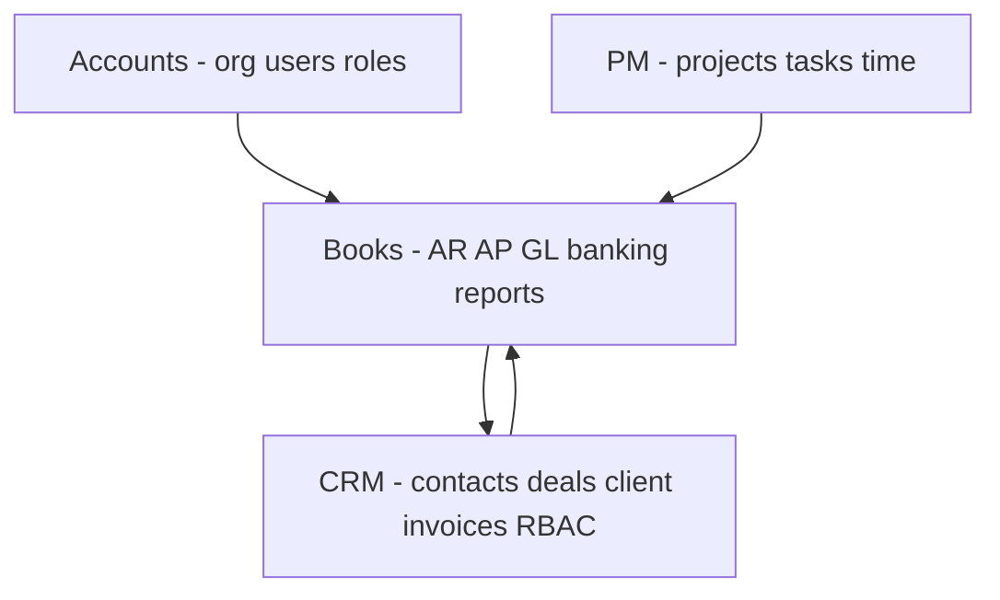
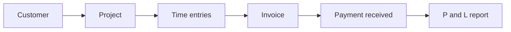

# Books App — Module Product Analysis & POC Assessment

Strategic overview of each Books module: **requirements**, **use cases**, **benefits**, **proof-of-concept (POC) status**, and **improvement recommendations**. Complements the technical references [BOOKS_MODULES_LOGIC_REFERENCE.md](./BOOKS_MODULES_LOGIC_REFERENCE.md) and [BOOKS_FUNCTIONALITY_GUIDE.md](./BOOKS_FUNCTIONALITY_GUIDE.md).

---

## Executive summary

**Books** is the Webfudge Platform’s accounting and billing layer—Zoho Books–inspired, built for **agency and professional-services** workflows (retainers, billable time, client expenses, multi-project billing). It shares auth, org tenancy, and UI patterns with **CRM**, **PM**, and **Accounts**.

| Dimension | Current state (POC) |
|-----------|---------------------|
| **Product vision** | Clear — unified books inside the platform |
| **UI / UX shell** | ~95% — 52 routes, CRM-aligned lists, dashboard, feature toggles |
| **Backend / API** | ~80% — org-scoped CRUD, aggregates, COA bootstrap, reports |
| **End-to-end workflows** | ~15% — few modules complete create → list → detail loops |
| **Platform integration** | Early — CRM invoice RBAC; PM/CRM data not fully linked in UI |

**POC verdict:** Books is a **strong vertical slice POC** (navigation, design system, data model, API surface) but not yet a **production accounting product**. The fastest path to value is finishing the **core agency loop**: Customer → Project → Time → Invoice → Payment → Reports.

---

## POC maturity scale

Use this scale when reading per-module POC ratings:

| Level | Meaning |
|-------|---------|
| **L0 — Concept** | Route or placeholder only; no real data |
| **L1 — UI POC** | Screens, tabs, KPIs, forms; mock or empty data |
| **L2 — API POC** | List/read or aggregate works against Strapi |
| **L3 — Workflow POC** | Create + list + at least one business action (e.g. status change) |
| **L4 — Production-ready** | Full CRUD, detail pages, validation, permissions, reporting, tested |

---

## Platform context

### Target personas

| Persona | Primary modules | Goals |
|---------|-----------------|-------|
| **Agency owner / Finance lead** | Home, Reports, Banking, Accountant | Cash position, P&L, compliance, month-close |
| **Account manager / Sales ops** | Sales, Customers, Estimates | Quote, invoice, collect receivables |
| **Project manager** | Time Tracking, Items | Track billable work, budgets vs actuals |
| **Bookkeeper / Accountant** | Purchases, Accountant, Banking, Documents | AP, journals, reconciliation, audit trail |
| **Individual contributor** | Timesheet | Log time, run timer |
| **Platform admin** | Accounts (org), Books activate | Org setup, COA seed, user access |

### Agency-specific design choices (already in product)

- **Client types:** `AgencyClient`, `DirectClient`, `Partner` on customers
- **Item types:** Service-first default; retainer and milestone types supported in schema
- **Billing methods:** Daily rate per user, fixed cost, task-based (`BillingMethod` on projects)
- **Billable expenses & time:** Flags for pass-through billing and `invoices/from-time`
- **Optional modules:** Estimates, retainers, sales orders, delivery challans, purchase orders—hideable for simpler orgs

### Cross-app dependencies

| Integration | Status | Opportunity |
|-------------|--------|-------------|
| **Accounts** | Auth + `current-org-id` | Org settings, fiscal year, `booksActivate` on first use |
| **CRM** | Customers = `/contacts`; invoice RBAC | Deal → estimate, contact sync, shared activity feed |
| **PM** | Separate `project`/`task` in Books | Single project truth or sync PM projects → Books billing |
| **Shared UI** | `@webfudge/ui`, `book-components` | Consistent with CRM/PM; reduces training cost |

---

## Module 1 — Home / Dashboard

### Purpose

Single pane for **financial health** and **daily operations**: receivables, payables, revenue trend, unbilled work, quick navigation to high-traffic modules.

### Functional requirements

| ID | Requirement | Priority |
|----|-------------|----------|
| H-1 | Show org-scoped KPIs: receivables, payables, net position, MoM revenue | P0 |
| H-2 | Surface unbilled hours and billable expenses | P0 |
| H-3 | Revenue / P&L trend charts (rolling months) | P1 |
| H-4 | Recent invoice/activity feed | P1 |
| H-5 | Quick-access shortcuts with live counts | P1 |
| H-6 | Activity timeline (cross-module events) | P2 |
| H-7 | Audit / recent-updates log | P2 |
| H-8 | Role-based dashboard widgets | P3 |

### Use cases

1. **Monday finance check** — Owner opens `/home`, sees receivables vs payables and overdue signals.
2. **Billing prep** — PM sees unbilled hours KPI and jumps to Time Tracking or Invoices.
3. **Month-end** — Bookkeeper reviews charts and recent activity before running reports.
4. **Onboarding** — New user uses quick-access cards to discover Sales, Banking, Reports.

### Benefits

| Stakeholder | Benefit |
|-------------|---------|
| Leadership | One screen for cash and billing risk without exporting to spreadsheets |
| Operations | Fewer context switches; aligns with CRM/PM dashboard familiarity |
| Finance | Early warning on unbilled WIP (work in progress) |

### POC status

| Layer | Rating | Notes |
|-------|--------|-------|
| UI | **L3** | Rich dashboard with charts, KPIs, quick access |
| Data | **L2** | Live entity aggregation on main dashboard |
| Activity / Updates | **L1** | Mock data; backend `recentActivities` exists |
| Server KPIs | **L2** | `dashboardApi.kpis()` implemented but **not used** on home page |

**POC summary:** Main dashboard proves **“we can show real org financials.”** Hub sub-pages prove **“we can build Zoho-style activity UX”** but not yet connected to backend.

### Improvements (recommended)

| Priority | Improvement | Rationale |
|----------|-------------|-----------|
| P0 | Wire `/home` to `dashboardApi.kpis()` + `topExpenses` | Single source of truth; faster than 6 parallel full entity fetches |
| P0 | Replace `homeHubMock` on Activity/Recent Updates with `recentActivities` | Completes hub POC |
| P1 | Add “action required” widgets: overdue invoices, uncategorized bank txns | Drives daily workflows |
| P1 | Fiscal period selector (month / quarter / FY) | Agency reporting norm |
| P2 | Personalize widgets by org role (Owner vs Member) | Reduces noise for ICs |
| P3 | Embed PM milestone/budget burn (if PM linked) | Agency-specific differentiator |

---

## Module 2 — Sales

Sales covers **order-to-cash**: customers, quotes, invoices, payments, credits, and optional order/delivery/retainer flows.

### Submodule: Customers

**Requirements:** CRUD customers; receivables & unused credits; client type; billing/shipping address; portal link; list filters (receivables, credits).

**Use cases:** Onboard agency client; view open AR per customer; segment “with receivables” for collections.

**Benefits:** Single customer ledger tied to CRM contacts; no duplicate master data if sync is enforced.

**POC:** **L3** — list LIVE; create form **L1** (no save).

**Improvements:** Wire create/update; detail page with statement; sync from CRM contact on create; credit note application UI.

---

### Submodule: Invoices

**Requirements:** Draft → Sent → Paid/Overdue lifecycle; line items (qty/hours, rate, tax); link to project/milestone/retainer; balance due; void; generate from billable time.

**Use cases:** Monthly retainer invoice; milestone billing; time-and-materials invoice from timesheet; send and track payment.

**Benefits:** Core revenue recognition for agency; bridges PM time to cash.

**POC:** **L3** — list LIVE; create **L1**; backend has `from-time`, status routes; **CRM RBAC** on invoices.

**Improvements:** Wire create/edit; PDF/email; payment allocation; `from-time` button on timesheet; recurring invoice scheduler; dunning for overdue.

---

### Submodule: Estimates

**Requirements:** Quote with expiry; statuses Draft/Sent/Accepted/Declined; convert to invoice.

**Use cases:** Pre-sales proposal for fixed-fee project; client approval before work starts.

**Benefits:** Shorter sales cycle; audit trail from quote to invoice.

**POC:** **L1** UI shell; backend **L3** (`convertToInvoice`).

**Improvements:** Wire list + create; link to CRM deal; e-sign or client portal accept.

---

### Submodule: Retainer Invoices, Sales Orders, Delivery Challans

**Requirements:** Retainer: draw down against prepaid balance. Sales orders: internal fulfillment before invoice. Challans: delivery proof (more relevant for goods).

**Use cases:** Agency retainer monthly draw; productized service packages; rare for pure services agencies.

**Benefits:** Matches Zoho Books breadth; feature-toggle hides complexity for small agencies.

**POC:** **L1** each.

**Improvements:** Only prioritize retainers for agency POC; defer challans/orders unless product vertical needs goods.

---

### Submodule: Payments Received, Recurring Invoices, Credit Notes

**Requirements:** Record payments against invoices; schedule recurring billing; issue credits and apply to AR.

**Use cases:** Client pays by bank transfer; monthly recurring retainer; goodwill credit after dispute.

**Benefits:** Complete AR sub-ledger; automated cash application.

**POC:** **L1** UI; backend CRUD **L2**.

**Improvements:** Payment → invoice matching UI; recurring template engine; credit application from customer detail.

---

### Sales module — aggregate assessment

| Aspect | Assessment |
|--------|------------|
| **Business criticality** | **Highest** — revenue |
| **POC overall** | **L2** — 2 of 9 submodules with live lists |
| **Top gap** | No create save, no detail pages, 7 empty lists |

**Strategic recommendation:** Treat Sales as **Phase 1 production target**: Customers + Invoices + Payments Received + Estimates (optional) before expanding optional modules.

---

## Module 3 — Purchases

Purchases covers **procure-to-pay**: vendors, expenses, bills, payments, POs, credits.

### Submodule: Vendors

**Requirements:** Vendor master; payables and unused vendor credits; contact details.

**Use cases:** Register subcontractor; track what you owe per vendor.

**Benefits:** Clean AP aging and 1099/vendor reporting foundation.

**POC:** **L1** — empty list; API ready.

---

### Submodule: Expenses

**Requirements:** Categorized expenses; billable to client/project; reimbursable flag; attach to invoice (`addToInvoice`).

**Use cases:** Pass-through software license to client; employee reimbursement; project cost tracking.

**Benefits:** **Key agency use case** — markup billable expenses on client invoices.

**POC:** **L1** UI; backend **L3** for `addToInvoice`.

**Improvements:** Mobile receipt capture; PM task link; approval workflow for reimbursements.

---

### Submodule: Bills, Payments Made, Recurring Bills, Vendor Credits

**Requirements:** Vendor invoices; payment runs; recurring utilities; vendor credits.

**Use cases:** Pay subcontractor bill; schedule monthly SaaS; apply vendor credit note.

**Benefits:** Complete AP and cash outflow picture with Banking.

**POC:** **L1** all lists.

---

### Submodule: Purchase Orders, Recurring Expenses

**Requirements:** PO approval before bill; repeating expense templates.

**Use cases:** Hardware purchase for client project; monthly coworking expense.

**Benefits:** Control spend; automate repetitive costs.

**POC:** **L1**; PO feature-gateable.

---

### Purchases module — aggregate assessment

| Aspect | Assessment |
|--------|------------|
| **Business criticality** | **High** — costs and billable pass-through |
| **POC overall** | **L1** |
| **Top gap** | Zero live lists; expenses not wired despite agency value |

**Strategic recommendation:** **Phase 1b** after Sales: Vendors + Expenses + Bills (minimum AP triangle).

---

## Module 4 — Items

### Purpose

**Product and service catalog** for invoice line items: rates, SKUs, tax flags, types (service, goods, digital, retainer package, milestone).

### Requirements

| ID | Requirement | Priority |
|----|-------------|----------|
| I-1 | CRUD items with type, rate, taxable flag | P0 |
| I-2 | Default type Service for agency | P0 |
| I-3 | Price lists (customer/group pricing) | P2 |
| I-4 | Inventory adjustments | P3 (if goods vertical) |

### Use cases

1. Define “Senior Developer — Hourly” as reusable line item on invoices.
2. Package “Monthly SEO Retainer” as retainer item type.
3. (Future) Client-specific rate on price list.

### Benefits

| Benefit | Detail |
|---------|--------|
| Consistency | Same rate across invoices and estimates |
| Speed | Pick from catalog vs free-text every time |
| Reporting | Revenue by item/SKU |

### POC status

| Submodule | POC |
|-----------|-----|
| All Items | **L1** — 2 hardcoded rows; API ready |
| Price Lists | **L0** — ModulePage mock |
| Inventory Adjustments | **L0** — mock |

**POC summary:** Schema and API prove catalog concept; UI does not yet demonstrate real catalog management.

### Improvements

| Priority | Improvement |
|----------|-------------|
| P0 | Wire `/items/all` + create `/items/new` |
| P1 | Link items to PM task types or CRM products |
| P2 | Price lists per customer tier |
| P3 | Inventory only if Books targets product companies |

---

## Module 5 — Banking

### Purpose

**Cash reality**: bank accounts, balances, transactions, categorization, reconciliation support.

### Requirements

| ID | Requirement | Priority |
|----|-------------|----------|
| B-1 | Multi-account overview and total balance | P0 |
| B-2 | Transaction list per account | P0 |
| B-3 | Categorize / bulk-categorize uncategorized txns | P1 |
| B-4 | Link txn to expense, payment, or journal | P1 |
| B-5 | Bank feed import (CSV/OFX/plaid) | P2 |
| B-6 | Reconciliation workflow | P2 |

### Use cases

1. **Daily check** — See total cash and uncategorized count (overview already supports this).
2. **Month-end** — Categorize remaining transactions; match to payments made/received.
3. **Audit** — Export account register for accountant.

### Benefits

| Stakeholder | Benefit |
|-------------|---------|
| Finance | Reduces spreadsheet bank tracking |
| Owner | Real-time cash KPI on dashboard |
| Compliance | Clear trail from bank line → GL category |

### POC status

| Feature | POC |
|---------|-----|
| Overview + KPIs + account table | **L3** |
| Add account | **L0** — button no-op |
| Transaction CRUD / categorize | **L2** backend only |
| Reconciliation | **L0** |

### Improvements

| Priority | Improvement |
|----------|-------------|
| P0 | Account create/edit UI |
| P0 | Uncategorized txn queue with categorize drawer |
| P1 | Rules engine (e.g. “AMAZON → Software SaaS”) |
| P1 | Match imported CSV |
| P2 | Open banking / Plaid (production) |
| P2 | Link dashboard “total balance” to `bankingApi` not client-side guess |

---

## Module 6 — Time Tracking

### Purpose

Connect **delivery** (projects, tasks, hours) to **billing** (invoices). Central to agency POC.

### Requirements

| ID | Requirement | Priority |
|----|-------------|----------|
| T-1 | Projects linked to customer; budget and billing method | P0 |
| T-2 | Log time (manual + timer) on tasks | P0 |
| T-3 | Billable vs non-billable; invoiced flag | P0 |
| T-4 | Weekly timesheet view | P1 |
| T-5 | Generate invoice from billable time | P0 |
| T-6 | Utilization reporting | P2 |

### Use cases

1. **Project setup** — Create “Website Redesign” for Acme, fixed fee + task-based T&M overflow.
2. **Daily logging** — Designer logs 6h billable on “Homepage mockups.”
3. **Billing** — Manager selects unbilled hours → generates invoice via `invoices/from-time`.
4. **Utilization** — Owner reviews billable % per user in Reports.

### Benefits

| Benefit | Detail |
|---------|--------|
| Revenue leakage prevention | Surfaces unbilled hours on dashboard |
| PM alignment | Same mental model as PM tasks (integration opportunity) |
| Transparency | Client-ready time detail on invoices |

### POC status

| Feature | POC |
|---------|-----|
| Projects list | **L3** |
| Timesheet list | **L2** |
| Timer start/stop | **L1** — UI only, API exists |
| Generate invoice | **L1** — button no-op |
| Weekly grid API | **L2** backend; not used in UI |
| Projects/new | **L0** — ModulePage mock |

### Improvements

| Priority | Improvement |
|----------|-------------|
| P0 | Real project create form; wire timer to `tasksApi` |
| P0 | “Generate invoice” → `invoicesApi.fromTime` |
| P1 | Sync or deep-link PM projects/tasks (avoid duplicate entry) |
| P1 | Approval flow for timesheets before billing |
| P2 | Budget burn widget on project row |
| P2 | Use `timesheetApi.weekly` for proper grid UX |

---

## Module 7 — Accountant

### Purpose

**General ledger discipline**: chart of accounts, manual journals, period controls, bulk maintenance, multi-currency adjustments.

### Requirements

| ID | Requirement | Priority |
|----|-------------|----------|
| A-1 | Chart of accounts (hierarchical); trial balance | P0 |
| A-2 | Manual journals with balanced entries; publish/reverse | P0 |
| A-3 | Org bootstrap seeds default COA | P0 |
| A-4 | Transaction locking by period | P2 |
| A-5 | Bulk update accounts | P2 |
| A-6 | Currency revaluation | P3 |

### Use cases

1. **Activation** — Admin runs `booksActivate`; 26 accounts created.
2. **Adjustment** — Accrue revenue journal at month-end; publish updates balances.
3. **Correction** — Reverse erroneous journal.
4. **Audit** — Export trial balance from chart of accounts.

### Benefits

| Stakeholder | Benefit |
|-------------|---------|
| Accountant | Double-entry backbone for reports |
| Compliance | Period lock prevents backdated chaos |
| Platform | Credibility vs “invoice-only” tools |

### POC status

| Feature | POC |
|---------|-----|
| COA bootstrap | **L3** — `booksActivate` |
| COA / journals UI | **L1** |
| Journal publish/reverse | **L3** backend |
| Posting trend API | **L2** — not in UI |
| Bulk update / currency / locking | **L0** UI placeholders |

### Improvements

| Priority | Improvement |
|----------|-------------|
| P0 | Wire chart of accounts list + journal create/publish UI |
| P1 | Auto-post journals from invoices, bills, payments (GL integration) |
| P1 | Show posting trend chart with real `journalsApi.postingTrend()` |
| P2 | Transaction locking before go-live |
| P3 | Multi-currency if org serves international clients |

---

## Module 8 — Reports

### Purpose

**Decision-grade financial and operational views** beyond the dashboard.

### Requirements

| ID | Requirement | Priority |
|----|-------------|----------|
| R-1 | Profit & Loss (accrual/cash, date range) | P0 |
| R-2 | Balance sheet | P0 |
| R-3 | Cash flow statement | P0 |
| R-4 | AR/AP aging | P1 |
| R-5 | Sales by customer; expenses by category | P1 |
| R-6 | Utilization (billable hours) | P1 |
| R-7 | Export PDF/Excel | P2 |

### Use cases

1. **Board pack** — P&L and cash flow for quarter.
2. **Collections** — AR aging to prioritize follow-ups.
3. **Project profitability** — Expenses by category + utilization by user.
4. **Tax prep** — Export P&L for accountant.

### Benefits

| Benefit | Detail |
|---------|--------|
| Trust | Leadership makes decisions on platform data |
| Retention | Reduces export to QuickBooks/Zoho for reporting only |
| Agency ops | Utilization report unique to services firms |

### POC status

| Feature | POC |
|---------|-----|
| Reports hub UI | **L2** |
| Charts (`BooksSystemAnalytics`, `BooksFinancialCharts`) | **L1** — `zeroMode` forces zeros |
| Backend report endpoints | **L3** |
| Balance sheet / cash flow pages | **L0** — `/coming-soon` |

### Improvements

| Priority | Improvement |
|----------|-------------|
| P0 | Set `zeroMode = false`; wire `reportsApi` |
| P0 | Implement balance sheet and cash flow pages |
| P1 | Date range + basis toggle on all reports |
| P1 | Drill-down from report line → transactions |
| P2 | Scheduled email reports |
| P2 | Compare periods (YoY, MoM) |

---

## Module 9 — Documents

### Purpose

**Document management** for invoices, receipts, contracts, and **bank statement** inbox.

### Requirements

| ID | Requirement | Priority |
|----|-------------|----------|
| D-1 | Upload and list documents with metadata | P1 |
| D-2 | Inbox types: All Documents, Bank Statements | P1 |
| D-3 | Processing status (Processed / Unreadable) | P2 |
| D-4 | Link document to invoice, bill, expense | P2 |

### Use cases

1. Store signed SOW with customer record.
2. Upload bank PDF → bank statements inbox → reconciliation.
3. Attach receipt photo to expense.

### Benefits

| Benefit | Detail |
|---------|--------|
| Audit | Single document store per org |
| Efficiency | No separate DMS for small agencies |

### POC status

**L1** — ModulePage mock only; `documentsApi` ready.

### Improvements

| Priority | Improvement |
|----------|-------------|
| P1 | Wire list + upload (reuse CRM upload patterns) |
| P2 | OCR for receipts |
| P2 | Link from expense/invoice detail |

---

## Module 10 — Threads

### Purpose

**Collaboration** on financial records (questions on invoice, approval chatter)—aligned with CRM threads pattern.

### Requirements

| ID | Requirement | Priority |
|----|-------------|----------|
| TH-1 | Conversation list | P3 |
| TH-2 | Thread per entity (invoice, bill) | P3 |
| TH-3 | Notifications | P3 |

### Use cases

Internal discussion before sending large invoice; client question on line items.

### Benefits

Context stays on platform vs Slack/email.

### POC status

**L0** — empty state only; not in sidebar.

### Improvements

Defer until core workflows ship; reuse CRM `direct-message` or comments API when prioritized.

---

## Module 11 — Auth, layout, and platform services

Not a business module but required for production.

### Requirements

Org-scoped auth; login; unauthorized page; `booksActivate` on first use; feature configuration; theme; route guards.

### POC status

| Feature | POC |
|---------|-----|
| Client auth guard | **L3** |
| Org header on API | **L3** |
| `booksActivate` auto on login | **L1** — manual/API only |
| Server middleware guard | **L0** |
| Feature prefs in localStorage only | **L2** |

### Improvements

Auto-activate Books for new orgs; persist feature flags in org settings; Next.js middleware; align API port default 1337.

---

## Cross-cutting gaps (all modules)

| Gap | Impact | Fix |
|-----|--------|-----|
| No `[id]` detail routes | Cannot view/edit/delete any record | Phase: detail pages per entity |
| Fake create submit | No end-to-end POC | Wire `BooksCrmAddEntityPage` `onSubmit` |
| Duplicate KPI computation | Home slow/inconsistent vs server | Use `dashboardApi` |
| PM vs Books duplicate projects | Double entry for agencies | Integration strategy |
| Invoice CRM RBAC only | Inconsistent permissions across Books | Unified Books permission module |
| No email/PDF | Cannot complete quote-to-cash | Notification + document generation service |
| No audit log UI | Recent Updates mock only | Wire Strapi audit or activity stream |

---

## Suggested POC roadmap (proof of complete workflows)

### POC A — “Agency billing loop” (4–6 weeks)

**Goal:** Prove one paying customer journey on platform data.

| Step | Module | Deliverable |
|------|--------|-------------|
| 1 | Sales | Customer create + detail |
| 2 | Time | Project create + timer + timesheet |
| 3 | Sales | Invoice create + from-time |
| 4 | Sales | Payment received allocate |
| 5 | Reports | P&L with `zeroMode` off |
| 6 | Home | Dashboard uses server KPIs |

**Success criteria:** Demo without mock data; numbers reconcile across dashboard and P&L.

---

### POC B — “Agency cost & cash” (3–4 weeks)

**Goal:** Prove payables and cash match bank.

| Step | Module | Deliverable |
|------|--------|-------------|
| 1 | Purchases | Vendor + expense + bill create |
| 2 | Purchases | Billable expense on invoice |
| 3 | Banking | Categorize transactions |
| 4 | Reports | AP aging + cash flow |

---

### POC C — “Accounting credibility” (2–3 weeks)

**Goal:** Prove GL-backed reporting.

| Step | Module | Deliverable |
|------|--------|-------------|
| 1 | Accountant | COA list + journal publish UI |
| 2 | Platform | Auto-post from invoice/bill payment |
| 3 | Reports | Balance sheet live |

---

### POC D — “Platform native” (ongoing)

| Step | Integration | Deliverable |
|------|-------------|-------------|
| 1 | CRM | Deal → estimate; contact sync |
| 2 | PM | Import billable tasks or shared project ID |
| 3 | Accounts | Fiscal year, books activation in settings |

---

## Improvement themes (prioritized)

### Tier 1 — Unblock production POC

1. Wire all create forms to API (`onSubmit` pattern in [BOOKS_FUNCTIONALITY_GUIDE.md](./BOOKS_FUNCTIONALITY_GUIDE.md)).
2. Add detail `[id]` routes for customer, invoice, vendor, bill, project.
3. Remove `zeroMode` from reports; implement balance sheet and cash flow.
4. Call `booksActivate()` after org select when not activated.
5. Fix env default API port 1337.

### Tier 2 — Agency differentiators

1. Time → invoice workflow (biggest ROI for services firms).
2. Billable expenses on client invoices.
3. Retainer balance on invoices (if retainers enabled).
4. Utilization report wired.
5. PM/CRM integration (avoid duplicate project/contact entry).

### Tier 3 — Enterprise parity

1. Recurring invoices/expenses automation.
2. Bank feed import and reconciliation.
3. PDF/email and client portal.
4. Multi-currency and transaction locking.
5. Threads / approvals on large invoices.

### Tier 4 — UX and scale

1. Server-side pagination and filters (replace client-only search).
2. Bulk actions on lists.
3. Role-based module visibility (not just localStorage feature flags).
4. Optimistic UI and error toasts on all mutations.
5. E2E tests for POC A workflow.

---

## Module comparison matrix

| Module | Criticality | POC level | Backend | Biggest improvement |
|--------|-------------|-----------|---------|---------------------|
| Home | High | L2 | Ready | Server KPIs + live activity |
| Sales | **Critical** | L2 | Ready | Create + detail + payments |
| Purchases | High | L1 | Ready | Wire expenses + bills |
| Items | Medium | L1 | Ready | Live catalog + `/items/new` |
| Banking | High | L2 | Ready | Categorize + add account |
| Time Tracking | **Critical** | L2 | Ready | Timer + invoice from time |
| Accountant | Medium | L1 | Strong | COA + journal UI |
| Reports | High | L1 | Ready | Wire APIs, drop zeroMode |
| Documents | Low | L1 | Ready | Upload + list |
| Threads | Low | L0 | None | Defer |

---

## Related documentation

| Document | Use when you need |
|----------|-------------------|
| [BOOKS_MODULES_LOGIC_REFERENCE.md](./BOOKS_MODULES_LOGIC_REFERENCE.md) | Technical behavior per route and API |
| [BOOKS_FUNCTIONALITY_GUIDE.md](./BOOKS_FUNCTIONALITY_GUIDE.md) | Integration checklist and phased wiring |
| [BOOKS_APP_UPDATE.md](./BOOKS_APP_UPDATE.md) | Initial scaffold scope |
| [ORG_CREATOR_ADMIN_USERS_SYNC.md](./ORG_CREATOR_ADMIN_USERS_SYNC.md) | Org context for multi-tenant POC |

---

*Last updated: June 2025 — product analysis aligned to current codebase POC state.*
