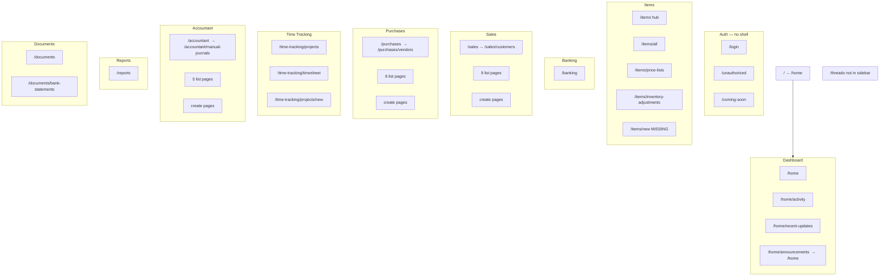

# Books App — Complete Sitemap

Full route map for `apps/books` (Next.js App Router, port **3005**).  
Base URL in development: `http://localhost:3005`

**Total implemented routes:** 52 `page.tsx` files  
**Linked but missing:** 2 create routes (`/items/new`, `/items/all/new`)  
**Detail routes (`[id]`):** None implemented

---

## Visual sitemap



---

## Sidebar navigation

Primary rail links (`components/layout/Sidebar.tsx`):

| # | Label | Sidebar href | Active prefix |
|---|-------|--------------|---------------|
| 1 | Dashboard | `/home` | `/home`, `/` |
| 2 | Items | `/items/all` | `/items/*` |
| 3 | Banking | `/banking` | `/banking/*` |
| 4 | Sales | `/sales` | `/sales/*` |
| 5 | Purchases | `/purchases` | `/purchases/*` |
| 6 | Time Tracking | `/time-tracking/projects` | `/time-tracking/*` |
| 7 | Accountant | `/accountant` | `/accountant/*` |
| 8 | Reports | `/reports` | `/reports/*` |
| 9 | Documents | `/documents` | `/documents/*` |

**Quick create menu** (sidebar `+`):

| Action | Href |
|--------|------|
| Invoice | `/sales/invoices/new` |
| Customer | `/sales/customers/new` |
| Expense | `/purchases/expenses/new` |
| Bill | `/purchases/bills/new` |
| Project | `/time-tracking/projects/new` |

**Not in sidebar:** `/threads`, `/login`, `/unauthorized`, `/coming-soon`

---

## Route redirects

| From | To | Mechanism |
|------|-----|-----------|
| `/` | `/home` | `app/page.tsx` — `redirect()` |
| `/home/announcements` | `/home` | `announcements/page.tsx` — `redirect()` |
| `/sales` | `/sales/customers` | `LayoutContent` + `getDefaultTabHref()` |
| `/purchases` | `/purchases/vendors` | same |
| `/items` | *(no auto-redirect)* | Hub page stays on `/items` |
| `/accountant` | `/accountant/manual-journals` | same |
| `/documents` | *(no auto-redirect)* | First tab href equals `/documents` |
| Unauthenticated `/*` | `/login` | `LayoutContent` client guard |

**Note:** `/time-tracking` has **no** `page.tsx`; sidebar links directly to `/time-tracking/projects`.

---

## 1. Root & auth

| Path | Title | Type | Auth | Notes |
|------|-------|------|------|-------|
| `/` | — | Redirect | — | → `/home` |
| `/login` | Login | Page | Public | `@webfudge/auth` |
| `/unauthorized` | Unauthorized | Page | Public | Access denied |
| `/coming-soon` | Coming soon | Page | Shell* | Query: `?feature=Balance%20sheet`, `?feature=Cash%20flow`, etc. |

\*Coming soon uses full-page layout outside main shell when accessed; reports hub links here for balance sheet & cash flow.

---

## 2. Dashboard (Home)

Sub-tabs (`SubPageTabs`): **Dashboard** · **Activity** · **Recent Updates**

| Path | Title | Type | Sub-tabs |
|------|-------|------|----------|
| `/home` | Dashboard | Page | Yes |
| `/home/activity` | Activity | Page | Yes |
| `/home/recent-updates` | Recent Updates | Page | Yes |
| `/home/announcements` | — | Redirect | → `/home` |

---

## 3. Items

Sub-tabs: **All Items** · **Price Lists** · **Inventory Adjustments**

| Path | Title | Type | Add href |
|------|-------|------|----------|
| `/items` | Items | Hub (card grid) | `/items/new` |
| `/items/all` | All Items | List | `/items/all/new` ⚠️ |
| `/items/price-lists` | Price Lists | List (mock) | `/items/new` |
| `/items/inventory-adjustments` | Inventory Adjustments | List (mock) | `/items/new` |

### Missing routes (linked, not implemented)

| Path | Linked from |
|------|-------------|
| `/items/new` | `getAddHref()`, topbar Add on items routes |
| `/items/all/new` | `items/all` page `addHref` |

---

## 4. Banking

No sub-tabs.

| Path | Title | Type | Add href |
|------|-------|------|----------|
| `/banking` | Banking | Overview page | *(topbar Add — no-op)* |

---

## 5. Sales

Sub-tabs (9): Customers · Estimates · Retainer Invoices · Sales Orders · Delivery Challans · Invoices · Payments Received · Recurring Invoices · Credit Notes

| Path | Title | Type | Feature toggle |
|------|-------|------|----------------|
| `/sales` | Sales | Hub | — |
| `/sales/customers` | Customers | List | Always on |
| `/sales/estimates` | Estimates | List | Hideable |
| `/sales/retainer-invoices` | Retainer Invoices | List | Hideable |
| `/sales/sales-orders` | Sales Orders | List | Hideable |
| `/sales/delivery-challans` | Delivery Challans | List | Hideable |
| `/sales/invoices` | Invoices | List | Always on |
| `/sales/payments-received` | Payments Received | List | Always on |
| `/sales/recurring-invoices` | Recurring Invoices | List | Always on |
| `/sales/credit-notes` | Credit Notes | List | Always on |

### Sales — create routes

| Path | Form | Dedicated vs dynamic |
|------|------|----------------------|
| `/sales/customers/new` | New Customer | Dedicated `page.tsx` |
| `/sales/invoices/new` | New Invoice | Dedicated `page.tsx` |
| `/sales/estimates/new` | New Estimate | `[module]/new` |
| `/sales/retainer-invoices/new` | New Retainer Invoice | `[module]/new` |
| `/sales/sales-orders/new` | New Sales Order | `[module]/new` |
| `/sales/delivery-challans/new` | New Delivery Challan | `[module]/new` |
| `/sales/recurring-invoices/new` | New Recurring Invoice | `[module]/new` |
| `/sales/credit-notes/new` | New Credit Note | `[module]/new` |
| `/sales/payments-received/new` | New Payment Received | `[module]/new` |

**Dynamic catch-all:** `/sales/[module]/new` — any other `module` slug renders a generic fallback form.

**Default Add from module root:** `/sales` → `/sales/customers/new` (`getAddHref`)

---

## 6. Purchases

Sub-tabs (8): Vendors · Expenses · Recurring Expenses · Purchase Orders · Bills · Payments Made · Recurring Bills · Vendor Credits

| Path | Title | Type | Feature toggle |
|------|-------|------|----------------|
| `/purchases` | Purchases | Hub | — |
| `/purchases/vendors` | Vendors | List | Always on |
| `/purchases/expenses` | Expenses | List | Always on |
| `/purchases/recurring-expenses` | Recurring Expenses | List | Always on |
| `/purchases/purchase-orders` | Purchase Orders | List | Hideable |
| `/purchases/bills` | Bills | List | Always on |
| `/purchases/payments-made` | Payments Made | List | Always on |
| `/purchases/recurring-bills` | Recurring Bills | List | Always on |
| `/purchases/vendor-credits` | Vendor Credits | List | Always on |

### Purchases — create routes

| Path | Form | Notes |
|------|------|-------|
| `/purchases/vendors/new` | New Vendor | Dedicated `page.tsx` |
| `/purchases/expenses/new` | New Expense | `[module]/new` |
| `/purchases/recurring-expenses/new` | New Recurring Expense | `[module]/new` |
| `/purchases/purchase-orders/new` | New Purchase Order | `[module]/new` |
| `/purchases/bills/new` | New Bill | `[module]/new` |
| `/purchases/payments-made/new` | New Payment Made | `[module]/new` |
| `/purchases/recurring-bills/new` | New Recurring Bill | `[module]/new` |
| `/purchases/vendor-credits/new` | New Vendor Credit | `[module]/new` |

**Also routable:** `/purchases/vendors/new` via `[module]/new` (empty config; dedicated page preferred).

**Default Add from module root:** `/purchases` → `/purchases/vendors/new`

---

## 7. Time Tracking

Sub-tabs: **Projects** · **Timesheet**

| Path | Title | Type | Add href |
|------|-------|------|----------|
| `/time-tracking/projects` | Projects | List | `/time-tracking/projects/new` |
| `/time-tracking/timesheet` | Timesheet | Custom table | — |
| `/time-tracking/projects/new` | New Project | Create (mock `ModulePage`) | — |

**No hub page** at `/time-tracking` (no `page.tsx`).

---

## 8. Accountant

Sub-tabs (5): Manual Journals · Bulk Update · Currency Adjustments · Chart of Accounts · Transaction Locking

| Path | Title | Type |
|------|-------|------|
| `/accountant` | Accountant | Hub |
| `/accountant/manual-journals` | Manual Journals | List + chart placeholders |
| `/accountant/bulk-update` | Bulk Update | List |
| `/accountant/currency-adjustments` | Currency Adjustments | List |
| `/accountant/chart-of-accounts` | Chart of Accounts | List |
| `/accountant/transaction-locking` | Transaction Locking | List |

### Accountant — create routes

| Path | Form |
|------|------|
| `/accountant/manual-journals/new` | New Manual Journal |
| `/accountant/bulk-update/new` | New Bulk Update |
| `/accountant/currency-adjustments/new` | New Currency Adjustment |
| `/accountant/chart-of-accounts/new` | New Chart of Account |
| `/accountant/transaction-locking/new` | New Transaction Lock |

All via `/accountant/[module]/new`.

**Default Add from module root:** `/accountant` → `/accountant/manual-journals/new`

---

## 9. Reports

No sub-tabs.

| Path | Title | Type | Linked sub-views |
|------|-------|------|------------------|
| `/reports` | Reports | Hub + analytics charts | P&L (self), Balance sheet → `/coming-soon`, Cash flow → `/coming-soon`, Documents → `/documents` |

---

## 10. Documents

Sub-tabs: **All Documents** · **Bank Statements**

| Path | Title | Type | Add href |
|------|-------|------|----------|
| `/documents` | All Documents | List (mock) | `null` (Add disabled) |
| `/documents/bank-statements` | Bank Statements | List (mock) | `null` |

---

## 11. Threads

| Path | Title | Type | Notes |
|------|-------|------|-------|
| `/threads` | Threads | Empty state | Not in sidebar |

---

## Flat URL index (all routes)

Alphabetical list of **implemented** paths (52):

```
/
/accountant
/accountant/bulk-update
/accountant/bulk-update/new          ← dynamic [module]/new
/accountant/chart-of-accounts
/accountant/chart-of-accounts/new
/accountant/currency-adjustments
/accountant/currency-adjustments/new
/accountant/manual-journals
/accountant/manual-journals/new
/accountant/transaction-locking
/accountant/transaction-locking/new
/accountant/[module]/new             ← dynamic (covers all accountant creates)
/banking
/coming-soon
/documents
/documents/bank-statements
/home
/home/activity
/home/announcements                  → redirect
/home/recent-updates
/items
/items/all
/items/inventory-adjustments
/items/price-lists
/login
/purchases
/purchases/bills
/purchases/bills/new
/purchases/expenses
/purchases/expenses/new
/purchases/payments-made
/purchases/payments-made/new
/purchases/purchase-orders
/purchases/purchase-orders/new
/purchases/recurring-bills
/purchases/recurring-bills/new
/purchases/recurring-expenses
/purchases/recurring-expenses/new
/purchases/vendor-credits
/purchases/vendor-credits/new
/purchases/vendors
/purchases/vendors/new
/purchases/[module]/new
/reports
/sales
/sales/credit-notes
/sales/credit-notes/new
/sales/customers
/sales/customers/new
/sales/delivery-challans
/sales/delivery-challans/new
/sales/estimates
/sales/estimates/new
/sales/invoices
/sales/invoices/new
/sales/payments-received
/sales/payments-received/new
/sales/recurring-invoices
/sales/recurring-invoices/new
/sales/retainer-invoices
/sales/retainer-invoices/new
/sales/sales-orders
/sales/sales-orders/new
/sales/[module]/new
/threads
/time-tracking/projects
/time-tracking/projects/new
/time-tracking/timesheet
/unauthorized
```

---

## Route counts by type

| Category | Count |
|----------|------:|
| Hub / landing pages | 6 |
| List / overview pages | 28 |
| Dedicated create pages | 4 |
| Dynamic create (`[module]/new`) | 3 route files → 20+ concrete URLs |
| Auth / utility | 4 |
| Redirect-only | 2 |
| **Implemented `page.tsx` files** | **52** |
| Missing (linked) | 2 |
| Detail `[id]` (planned, none) | 0 |

---

## External / report deep links

| Source | Target |
|--------|--------|
| Reports hub — Balance sheet | `/coming-soon?feature=Balance%20sheet` |
| Reports hub — Cash flow | `/coming-soon?feature=Cash%20flow` |
| Reports hub — Document vault | `/documents` |
| Reports hub — P&L | `/reports` (same page) |

---

## Planned routes (not implemented)

Recommended future sitemap additions for production parity:

```
/items/new
/items/all/new
/items/[id]
/sales/customers/[id]
/sales/invoices/[id]
/sales/estimates/[id]
… (detail routes per entity)
/banking/accounts/[id]
/banking/transactions
/reports/profit-loss
/reports/balance-sheet
/reports/cash-flow
/reports/receivables-aging
/reports/payables-aging
```

---

## Related docs

| Document | Purpose |
|----------|---------|
| [BOOKS_MODULES_LOGIC_REFERENCE.md](./BOOKS_MODULES_LOGIC_REFERENCE.md) | Per-route behavior and API wiring |
| [BOOKS_MODULES_PRODUCT_ANALYSIS.md](./BOOKS_MODULES_PRODUCT_ANALYSIS.md) | Requirements and POC per module |
| [BOOKS_FUNCTIONALITY_GUIDE.md](./BOOKS_FUNCTIONALITY_GUIDE.md) | Integration status |

---

*Generated from `apps/books/app/**/page.tsx` and `lib/tabs.ts` — June 2025*
